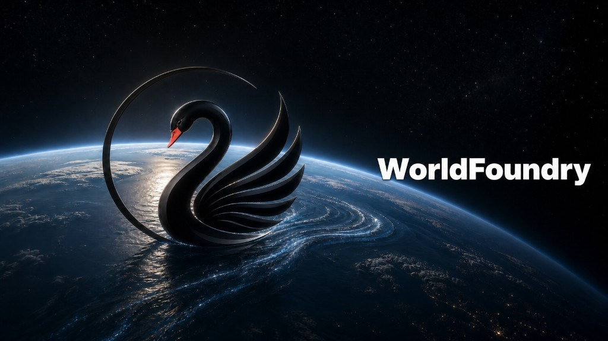

# WorldFoundry

[](pyproject.toml)
[](LICENSE)
[](docs/fumadocs/content/docs/reference/cli.mdx)
[](docs/fumadocs)

WorldFoundry is an open-source infrastructure for world models: a shared stack for in-tree runners, local asset staging, inference (TUI / CLI / Studio), and benchmark evaluation across video generation, 3D/4D representation, embodied action, and interactive worlds.

> ⚠️ This repository is still under active development. We will keep updating it regularly. Feel free to open an issue if you encounter any problem.

Day-one workflow:

1. **Environment + assets** — bootstrap conda, stage checkpoints and datasets outside git.
2. **Inference** — generate and inspect artifacts via TUI, CLI, scripts, or Studio.
3. **Evaluation** — score only after artifacts match the benchmark layout; use scorecards for readiness claims.

## 🤝 Community

Join the **WorldFoundry Community** on Slack, [Discord](https://discord.gg/ybUQMDA4x), or WeChat for discussions, announcements, technical support, and the latest project updates.

<p align="center">

<a href="https://join.slack.com/t/worldfoundrycommunity/shared_invite/zt-43nbi9fw4-okYiELzZHp0_1UPa3dh3bQ">
  
</a>

<a href="https://github.com/WorldFoundry/WorldFoundry/discussions">
  
</a>

</p>

<p align="center">
  <strong>WeChat Community</strong>
</p>

<table align="center">
  <tr>
    <td align="center"><strong>Group 1 — Full</strong></td>
    <td align="center"><strong>Group 2 — Full</strong></td>
    <td align="center"><strong>Group 3 — Open</strong></td>
  </tr>
  <tr>
    <td align="center"></td>
    <td align="center"></td>
    <td align="center"></td>
  </tr>
</table>

<p align="center">
  <em>Groups 1 and 2 are full. Scan the Group 3 QR code to join.<br>
  QR codes are updated periodically if they expire.</em>
</p>

## 📰 News

- **[2026-07-12]** 🔥 **WorldFoundry reached 100+ stars on its very first day!** Thanks to the community for the incredible support and encouragement. More exciting updates are coming!
- **[2026-07-11]** 🎉 **WorldFoundry is officially open-sourced.** We welcome ⭐ stars, bug reports, feature requests, and pull requests from the community!
- **[Coming Soon]** Documentation improvements and additional benchmark integrations.




## Links

- [Documentation](docs/fumadocs/content/docs/index.mdx)
- [Project overview](docs/fumadocs/content/docs/overview/index.mdx)
- [Design and architecture](docs/fumadocs/content/docs/overview/design.mdx)
- [Why WorldFoundry](docs/fumadocs/content/docs/overview/why-worldfoundry.mdx)
- [Quickstart](docs/fumadocs/content/docs/quickstart.mdx)
- [Environment reference](docs/fumadocs/content/docs/reference/environments.mdx)
- [Local asset preparation](docs/fumadocs/content/docs/guides/local-assets.mdx)
- [TUI](docs/fumadocs/content/docs/guides/tui.mdx)
- [Inference guide](docs/fumadocs/content/docs/guides/inference.mdx)
- [Studio guide](docs/fumadocs/content/docs/guides/studio.mdx)
- [CLI reference](docs/fumadocs/content/docs/reference/cli.mdx)
- [Python API reference](docs/fumadocs/content/docs/api-reference/index.mdx)
- [Supported models](docs/fumadocs/content/docs/guides/supported-models/index.mdx)
- [Benchmark hub](docs/fumadocs/content/docs/evaluation/benchmark-hub/index.mdx)
- [Contributing](CONTRIBUTING.md)

## Demo Gallery

These examples are served from the official GitHub `main` tree so a new user can see the expected artifact shape before running GPU jobs. Full release claims still require the matching run manifest, runtime profile, and validation scorecard.

<table>
  <tr>
    <td width="33%">
      <a href="https://raw.githubusercontent.com/OpenEnvision/WorldFoundry/main/docs/fumadocs/public/readme-demos/ltx2-3-i2v-penguin.mp4"></a>
      <br><strong>LTX-2.3</strong><br><sub>Image-to-video</sub>
    </td>
    <td width="33%">
      <a href="https://raw.githubusercontent.com/OpenEnvision/WorldFoundry/main/docs/fumadocs/public/readme-demos/wan2-1-vace-girl-snake.mp4"></a>
      <br><strong>Wan2.1 VACE</strong><br><sub>Image/control-to-video</sub>
    </td>
    <td width="33%">
      <a href="https://raw.githubusercontent.com/OpenEnvision/WorldFoundry/main/docs/fumadocs/public/readme-demos/skyreels-v3-reference-to-video.mp4"></a>
      <br><strong>SkyReels V3</strong><br><sub>Reference-to-video</sub>
    </td>
  </tr>
  <tr>
    <td width="33%">
      <a href="https://raw.githubusercontent.com/OpenEnvision/WorldFoundry/main/docs/fumadocs/public/readme-demos/unianimate-dit-human-animation.mp4"></a>
      <br><strong>UniAnimate-DiT</strong><br><sub>Human animation</sub>
    </td>
    <td width="33%">
      <a href="https://raw.githubusercontent.com/OpenEnvision/WorldFoundry/main/docs/fumadocs/public/readme-demos/open-sora-plan-tokyo-street.mp4"></a>
      <br><strong>Open-Sora-Plan</strong><br><sub>Text-to-video</sub>
    </td>
    <td width="33%">
      <a href="https://raw.githubusercontent.com/OpenEnvision/WorldFoundry/main/docs/fumadocs/public/readme-demos/hunyuanvideo-i2v-firework-official.mp4"></a>
      <br><strong>HunyuanVideo I2V</strong><br><sub>Image-to-video</sub>
    </td>
  </tr>
  <tr>
    <td width="33%">
      <a href="https://raw.githubusercontent.com/OpenEnvision/WorldFoundry/main/docs/fumadocs/public/readme-demos/hunyuanvideo-t2v-cat-grass-official.mp4"></a>
      <br><strong>HunyuanVideo T2V</strong><br><sub>Text-to-video</sub>
    </td>
    <td width="33%">
      <a href="https://raw.githubusercontent.com/OpenEnvision/WorldFoundry/main/docs/fumadocs/public/readme-demos/cogvideo_01.mp4"></a>
      <br><strong>CogVideoX</strong><br><sub>Text-to-video</sub>
    </td>
    <td width="33%">
      <a href="https://raw.githubusercontent.com/OpenEnvision/WorldFoundry/main/docs/fumadocs/public/readme-demos/ac3d_02.mp4"></a>
      <br><strong>AC3D</strong><br><sub>Camera/world scene</sub>
    </td>
  </tr>
  <tr>
    <td width="33%">
      <a href="https://raw.githubusercontent.com/OpenEnvision/WorldFoundry/main/docs/fumadocs/public/readme-demos/astra_02.mp4"></a>
      <br><strong>Astra</strong><br><sub>World navigation</sub>
    </td>
    <td width="33%">
      <a href="https://raw.githubusercontent.com/OpenEnvision/WorldFoundry/main/docs/fumadocs/public/readme-demos/warp_02.mp4"></a>
      <br><strong>Warp</strong><br><sub>World navigation</sub>
    </td>
    <td width="33%">
      <a href="https://raw.githubusercontent.com/OpenEnvision/WorldFoundry/main/docs/fumadocs/public/readme-demos/matrix-game-2-official-universal.mp4"></a>
      <br><strong>Matrix-Game-2</strong><br><sub>Interactive world model</sub>
    </td>
  </tr>
  <tr>
    <td width="33%">
      <a href="https://raw.githubusercontent.com/OpenEnvision/WorldFoundry/main/docs/fumadocs/public/readme-demos/hy-worldplay-official-8gpu.mp4"></a>
      <br><strong>HY-WorldPlay</strong><br><sub>8-GPU image-pose world video</sub>
    </td>
    <td width="33%">
      <a href="https://raw.githubusercontent.com/OpenEnvision/WorldFoundry/main/docs/fumadocs/public/readme-demos/hunyuan-game-craft-village.mp4"></a>
      <br><strong>Hunyuan GameCraft</strong><br><sub>Interactive village world</sub>
    </td>
    <td width="33%">
      <a href="https://raw.githubusercontent.com/OpenEnvision/WorldFoundry/main/docs/fumadocs/public/readme-demos/matrix-game-3-cityscape.mp4"></a>
      <br><strong>Matrix-Game-3</strong><br><sub>Cityscape world model</sub>
    </td>
  </tr>
  <tr>
    <td width="33%">
      <a href="https://raw.githubusercontent.com/OpenEnvision/WorldFoundry/main/docs/fumadocs/public/readme-demos/worldcam-industrial.mp4"></a>
      <br><strong>WorldCam</strong><br><sub>Camera-path world video</sub>
    </td>
    <td width="33%">
      <a href="https://raw.githubusercontent.com/OpenEnvision/WorldFoundry/main/docs/fumadocs/public/readme-demos/yume-1p5-jungle-castle.mp4"></a>
      <br><strong>YUME-1.5</strong><br><sub>First-person world navigation</sub>
    </td>
    <td width="33%">
      <a href="https://raw.githubusercontent.com/OpenEnvision/WorldFoundry/main/docs/fumadocs/public/readme-demos/neoverse-robot-tabletop.mp4"></a>
      <br><strong>NeoVerse</strong><br><sub>Robot video-input world model</sub>
    </td>
  </tr>
  <tr>
    <td width="33%">
      <a href="https://raw.githubusercontent.com/OpenEnvision/WorldFoundry/main/docs/fumadocs/public/readme-demos/hunyuan-world-voyager-case1.mp4"></a>
      <br><strong>HunyuanWorld-Voyager</strong><br><sub>Conditioned world video</sub>
    </td>
    <td width="33%">
      <a href="https://raw.githubusercontent.com/OpenEnvision/WorldFoundry/main/docs/fumadocs/public/readme-demos/cosmos3.mp4"></a>
      <br><strong>Cosmos3</strong><br><sub>World video generation</sub>
    </td>
    <td width="33%">
      <a href="https://raw.githubusercontent.com/OpenEnvision/WorldFoundry/main/docs/fumadocs/public/readme-demos/flashworld.mp4"></a>
      <br><strong>FlashWorld</strong><br><sub>World video generation</sub>
    </td>
  </tr>
  <tr>
    <td width="33%">
      <a href="https://raw.githubusercontent.com/OpenEnvision/WorldFoundry/main/docs/fumadocs/public/readme-demos/sana.mp4"></a>
      <br><strong>Sana</strong><br><sub>Video generation</sub>
    </td>
    <td width="33%">
      <a href="https://raw.githubusercontent.com/OpenEnvision/WorldFoundry/main/docs/fumadocs/public/readme-demos/lingbot-world.mp4"></a>
      <br><strong>LingBot World</strong><br><sub>World-action generation</sub>
    </td>
    <td width="33%">
      <a href="https://raw.githubusercontent.com/OpenEnvision/WorldFoundry/main/docs/fumadocs/public/readme-demos/wan2-2.mp4"></a>
      <br><strong>Wan2.2</strong><br><sub>Video generation</sub>
    </td>
  </tr>
  <tr>
    <td width="33%">
      <a href="https://raw.githubusercontent.com/OpenEnvision/WorldFoundry/main/docs/fumadocs/public/readme-demos/luciddreamer.mp4"></a>
      <br><strong>LucidDreamer</strong><br><sub>World video generation</sub>
    </td>
    <td width="33%">
      <a href="https://raw.githubusercontent.com/OpenEnvision/WorldFoundry/main/docs/fumadocs/public/readme-demos/gen3c.mp4"></a>
      <br><strong>GEN3C</strong><br><sub>3D-aware video generation</sub>
    </td>
    <td width="33%">
      <a href="https://raw.githubusercontent.com/OpenEnvision/WorldFoundry/main/docs/fumadocs/public/readme-demos/longcat.mp4"></a>
      <br><strong>LongCat</strong><br><sub>World video generation</sub>
    </td>
  </tr>
</table>

More curated generated samples are embedded in the Studio docs.

## What WorldFoundry Provides

| Surface | Purpose | Entry point |
| --- | --- | --- |
| Model zoo | Catalogs video, world, 3D/4D, VLA/VA/WAM, hosted API, and metadata-only model entries. | [`worldfoundry/data/models/catalog`](worldfoundry/data/models/catalog) |
| In-tree runtimes | Keeps model architecture and inference adapters inside `worldfoundry`; checkpoints stay in local/Hugging Face caches. | [`worldfoundry/synthesis`](worldfoundry/synthesis), [`worldfoundry/pipelines`](worldfoundry/pipelines) |
| TUI | Interactive model/benchmark picker that prints runnable CLI commands. | `worldfoundry-eval tui` / `worldfoundry-tui` |
| Studio workspace | Browser UI for inference jobs, model-specific parameters, and artifact review. | [`worldfoundry.studio.workspace_app`](worldfoundry/studio/workspace_app.py) |
| Benchmark zoo | Catalogs benchmark manifests, required assets, official runner constraints, and readiness states. | [`worldfoundry/data/benchmarks/catalog`](worldfoundry/data/benchmarks/catalog) |
| Evaluation runner | Runs model × benchmark cells, imports existing outputs, and writes normalized scorecards. | [`worldfoundry/evaluation`](worldfoundry/evaluation) |
| Docs | Bilingual Fumadocs site with setup, inference, evaluation, Studio, and maintainer guides. | [`docs/fumadocs`](docs/fumadocs) |

## From Clone To First Run

Choose the install track that matches the work you are doing:

| Track | Use it for | Install |
| --- | --- | --- |
| **Lightweight / CPU** | Catalog and CLI inspection, TUI use, docs work, and CPU release checks | An editable pip install with only the required extras, for example `python -m pip install -e ".[tui]"` |
| **GPU runtime** | CUDA inference, Studio model execution, and GPU-backed benchmark runners | `bash scripts/setup/bootstrap_worldfoundry.sh` |

Optional extras declare Python dependencies but do not select a CUDA-specific
PyTorch wheel index. Do not treat a bare pip install of a GPU-coupled extra as
the supported CUDA setup; use the bootstrap/conda track instead. Optional native
kernels must be built inside the exact target PyTorch environment.

For GPU work, start with the unified environment and use a dedicated
environment only when a model profile documents an ABI or simulator conflict.
The full day-one path lives in the
[Quickstart](docs/fumadocs/content/docs/quickstart.mdx).

Model demo videos are served from GitHub CDN; docs development does not need `git lfs pull`.

```bash
# Recommended: skip LFS smudge for a much faster clone
GIT_LFS_SKIP_SMUDGE=1 git clone https://github.com/OpenEnvision/WorldFoundry.git

# Optional: install Git LFS first if you want local demo video binaries
git lfs install
git clone https://github.com/OpenEnvision/WorldFoundry.git

cd WorldFoundry

bash scripts/setup/bootstrap_worldfoundry.sh
source tmp/worldfoundry_unified_env.sh
conda activate "${WORLDFOUNDRY_UNIFIED_ENV_PREFIX}"
```

Checkpoints, datasets, evaluator weights, API keys, and generated artifacts are **not** in git.
See [Local asset preparation](docs/fumadocs/content/docs/guides/local-assets.mdx) for cache layout, Hugging Face downloads, non-HF aliases, and benchmark assets.

On modern CUDA 12.8 hosts the installer resolves `worldfoundry-unified-cu128`. Pin a wheel tier only when the host requires it:

```bash
bash scripts/setup/bootstrap_worldfoundry.sh --cuda cu124
bash scripts/setup/bootstrap_worldfoundry.sh --cuda cu121
```

Keep datasets and checkpoints outside the repository on shared machines:

```bash
bash scripts/setup/bootstrap_worldfoundry.sh \
  --home /path/to/worldfoundry-home \
  --data-root /path/to/worldfoundry-data \
  --model-root /path/to/worldfoundry-models \
  --artifact-root /path/to/worldfoundry-artifacts
```

Hugging Face models use native Hub loading (`from_pretrained`, `snapshot_download`, `HF_HOME` / `HF_HUB_CACHE`, and `HF_TOKEN` for gated assets). `WORLDFOUNDRY_CKPT_DIR` remains for non-HF checkpoints and compatibility aliases.

Some VLA/action policies need a documented model-specific environment (for example OpenVLA-OFT / CogACT). Embodied simulator benchmarks follow the Docker VLA harness pattern — see the [environment reference](docs/fumadocs/content/docs/reference/environments.mdx).

After the environment is active:

```bash
worldfoundry-eval --help
worldfoundry-eval zoo models --json
worldfoundry-eval zoo benchmarks --json
```

### Interactive first path (TUI)

```bash
python -m pip install -e ".[tui]"
worldfoundry-eval tui
# or: worldfoundry-tui
```

The TUI reads the same catalogs as the CLI and can print a runnable command before anything expensive runs:

```bash
worldfoundry-eval tui \
  --model-id <model-id> \
  --benchmark-id <benchmark-id> \
  --print-command
```

### Scripted first model run

Prepare assets, then launch a small demo. A common starter is `matrix-game-2` (public HF repo `Skywork/Matrix-Game-2.0`):

```bash
bash scripts/inference/prepare_model_infer.sh matrix-game-2 --download
worldfoundry-eval zoo model-download --model-id matrix-game-2 --check-local --json

bash scripts/inference/run_nav_video_gen.sh matrix-game-2 \
  --output-dir tmp/matrix_game2_first_run
```

Echo-Memory is integrated as eleven independent, immutable model recipes on top
of the canonical in-tree Wan 2.1 implementation. The public model ID fixes the
memory architecture and checkpoint path; there is no mutable `memory_method`
switch. Current upstream weight availability and the extension contract for new
research memories are documented in the
[inference guide](docs/fumadocs/content/docs/guides/inference.mdx) and the
[Echo-Memory model card](docs/fumadocs/content/docs/guides/supported-models/echo-memory-context-k1.mdx).
The released K=1 checkpoint has exact structural coverage in the native model;
a fresh post-cutover CUDA artifact, official-sample parity, and benchmark scoring
remain pending.

Matrix-Game 3.5 is exposed as two separate recipes,
`matrix-game-3.5-first-person` and `matrix-game-3.5-third-person`; each is
permanently bound to its matching checkpoint, including its checkpoint-specific
subject-reference embedding capacity. Camera-NPZ inference, the three
shared asset repositories, and the memory-research extension points are covered
in the [inference guide](docs/fumadocs/content/docs/guides/inference.mdx) and
[local-assets guide](docs/fumadocs/content/docs/guides/local-assets.mdx).
Its package-data profiles use inference-native names such as
`num_inference_blocks`, `num_inference_steps`, `guidance_scale`, and
`inference_seed`; no copied validation runner or diagnostic artifact path is
part of the model runtime.

If weights already live in a shared checkpoint tree, link them instead of copying:

```bash
bash scripts/setup/link_hf_checkpoints.sh \
  --ckpt-dir "${WORLDFOUNDRY_CKPT_DIR}" \
  --hfd-root "${WORLDFOUNDRY_HFD_ROOT}" \
  --hf-hub-cache "${HF_HUB_CACHE}" \
  --default-world
```

## Run Inference

Prefer the TUI or the documented inference helpers once assets are staged:

```bash
bash scripts/inference/run_nav_video_gen.sh matrix-game-2

conda run -p "${WORLDFOUNDRY_UNIFIED_ENV_PREFIX}" \
  bash scripts/inference/run_nav_video_gen.sh matrix-game-2

bash scripts/inference/run_infer.sh --category video --model <model-id>
bash scripts/inference/run_infer.sh --category three_d_four_d --model <model-id>
```

CLI-shaped inference (same contract as Studio jobs):

```bash
python -m worldfoundry.studio.workspace_job infer \
  --model-id <model-id> \
  --prompt "a cinematic scene, high quality" \
  --output-dir tmp/worldfoundry_infer/<model-id> \
  --device cuda
```

Each successful run should write media, logs, and manifest metadata under the output directory. Treat a file as demo evidence only after visual check and matching runtime-profile assumptions. Details: [Inference guide](docs/fumadocs/content/docs/guides/inference.mdx).

### Opt-in inference acceleration

Native diffusion pipelines accept request-scoped acceleration providers; they
do not require a process-wide attention environment variable. Every loaded
module records the requested backend, effective backend, and fallback reason.
The exact path remains the default.

```python
from worldfoundry.pipelines.wan.pipeline_wan_2p2 import Wan2p2Pipeline

pipe = Wan2p2Pipeline.from_pretrained(
    model_path="/checkpoints/wan22",
    device="cuda",
    offload_mode="resident",           # aliases: fast/none; async-block when VRAM is tight
    attention_backend="flash2",       # flash2/flash3/sage/sage3/xformers
    quantization={"mode": "fp8"},     # runtime report proves kernel vs dense fallback
    fuse_qkv=True,
    fused_rope=True,
    static_cross_kv=True,
    torch_compile=True,
    teacache=True,                      # lossy and explicit
    vae_decode_autocast="bf16",
    vae_spatial_tiling=True,
    vae_temporal_chunk_size=4,
)
```

Wan2.2 TI2V-5B uses the resident preset by default in Studio on the target H100
path. `block`/`async-block` now selects the layer-container implementation: it
primes layer 0 and overlaps the next layer's pinned-host H2D copy with current
compute. Runtime telemetry requires positive async copies, zero synchronous
rescue copies, and at most two CUDA-resident layers before calling it effective.
Quantization plus block offload is rejected until quantized buffer movement has
its own certified lifecycle; use resident quantization or dense async offload.

FlashAttention and xFormers are numerically equivalent provider choices;
SageAttention, FP8/NVFP4, STA/VSA/VMoBA, the pinned LightX2V sparse lanes,
TeaCache, and token pruning are approximate
and must pass the target model's quality budget. Missing packages, unsupported
GPU architectures, or unsupported shapes either fall back to a reported exact
path or fail closed, according to the selected algorithm's public contract.

FastVideo-style VSA additionally requires a model-specific 3D sparse plan and
checkpoint-trained `gate_compress` VSA-QAT weights. VMoBA is different: it is a
weight-free FastVideo router and is wired to the real top-level
`fastvideo_kernel.moba_attn_varlen`, `process_moba_input`, and
`process_moba_output` provider symbols. It alternates temporal, spatial, and 3D
chunks by Wan block index. VMoBA therefore requires a complete grid-specific
chunk/top-k profile, but no learned router checkpoint. Missing symbols,
incompatible shape/device/dtype, or incomplete routing metadata fail closed;
there is no dense fallback that can masquerade as VMoBA. Request-window receipts
must show provider calls and all three chunk routes. GPU quality and full-pipeline
E2E performance are not yet certified.

The certifying sparse CLI exposes all twelve pinned-LightX2V Wan lanes:
`dynamic_sparse`, `sparge`, `nbhd`, `lightx2v_sla_mask`, `flexblock`,
`lightx2v_spas_sage`, `draft_attn`, `radial_attn`, `rainfusion_attn`,
`svg_attn`, `svg2_attn`, and `lightx2v_svg_mask`. Every provider event must
match the normalized operator's canonical kernel symbol and `provider_family`,
come from clean commit `6fb7c1362b89d4908a9ea197bac4fbd7482ee2d5`, and
carry a matching source fingerprint in the flattened event emitted by the real
provider call. DraftAttention's warmup layer and RainFusion's scheduled dense
phase are recorded as `provider_dense`, never as sparse or fallback. SVG2
reuses a locked 128 MiB `uint8` FlashInfer workspace/wrapper per device and
backend, replans every dynamic mask, and keeps K-means centroids request-local.
SLA top-k geometries that truncate to zero selected key blocks are rejected
before CUDA launch; pinned LightX2V otherwise feeds an empty LUT to the kernel,
which can return finite but invalid output on short sequences.
The old nested `provider_receipt` schema is rejected. The explicitly prefixed
names are LightX2V GeneralSparse mask/operator compositions; they do **not**
certify FastVideo `SLA_ATTN` or `SAGE_SLA_ATTN`.

LightX2V's upstream “over 50×” headline is tied to the complete Wan2.2 A14B
profile: a four-step distilled checkpoint, CFG disabled, 480×832×81 output,
NVFP4 weights, DynamicSparse Sage2 at `sparsity_ratio=0.9`, and one RTX 5090.
It is not a claim for any one kernel in isolation. This repository's current
Wan2.2 TI2V-5B, 50-step, CFG-on A/B workload is a different model and workload,
so it cannot reproduce that number or support a SOTA claim. The upstream
`sage_attn2_k_int8_v_fp8` registry entry is also intentionally rejected for
Wan A/B: it accepts pre-quantized K/V tuples, while the Wan generator supplies
floating K/V and has no audited quantize/cache/invalidation lifecycle.

Those FastVideo algorithms are now independently exposed as `fastvideo_sla`
and `fastvideo_sagesla`. They execute on Wan self-attention through the pinned
FastVideo provider and require complete checkpoint-owned learned `proj_l`
Sparse+Linear weights. The loader keeps `proj_l` in FP32 and fails closed on a
missing layer, mixed layout, malformed projection, dirty/unpinned provider, or
dense substitution; request receipts bind every branch/step/layer call to the
provider source and per-layer/global projection fingerprints. Official dense
Wan and the currently staged FastVideo CausalWan Preview checkpoints contain no
`proj_l`, so they cannot run or certify this lane. `fastvideo_sagesla` also
requires `spas_sage_attn`. Compatibility aliases such as `sla` and `sagesla`
remain excluded because they are ambiguous with LightX2V mask modes. GPU
quality and isolated repeated E2E performance are still uncertified.

Native Ulysses SP composes with offset- and padding-aware fused 3D RoPE, with
runtime call counters required for certification. SP combined with TeaCache,
AdaCache, MagCache, feature cache, TaylorSeer, approximate attention, or CUDA
Graph is still rejected at construction time until its rank-synchronization or
graph-safe collective mechanism exists. INT8 uses a dynamic per-token/per-channel
W8A8 Triton kernel on qualified CUDA shapes and reports calibrated BF16 dispatch
separately from true fallback. Its default full-Wan profile currently fails the
quality gate and remains experimental. INT4/groupwise and GGUF remain
compressed-storage plus dequantize/dense paths, not claimed low-bit speed
kernels. See the
[inference optimization truth matrix](docs/fumadocs/content/docs/guides/inference-optimization.mdx)
for CPU-contract, GPU-certified, pending, and rejected states.

Wan feature caching distinguishes the compatibility algorithm `taylorseer`
(one whole-stack residual) from `blocktaylorseer` (the pinned LightX2V
`[dense, skip, skip, skip]` schedule with independent per-block self-attention,
cross-attention, and FFN first-order histories). Cache hits still apply the
current step's modulation gates. `custom` matches LightX2V's calibrated Tea
decision plus first-order whole-stack residual prediction. Cache ownership is
keyed by explicit request identity and CFG branch; runner cleanup snapshots a
bounded immutable receipt and releases tensor history. These are approximate
CPU/runtime contracts, not GPU video-quality or SOTA performance certification.

Generate new formal SP evidence with the same fused-RoPE/FP64 semantics in the
single-rank reference and multi-rank candidate:

```bash
torchrun --nproc_per_node=1 -m benchmarks.inference.wan22_multigpu_e2e \
  --checkpoint /checkpoints/Wan2.2-TI2V-5B \
  --output-dir benchmarks/results/wan22-sp1 \
  --fused-rope --rope-precision fp64 \
  --save-reference-latents \
  --warmup-runs 1 --measured-runs 3

torchrun --nproc_per_node=4 -m benchmarks.inference.wan22_multigpu_e2e \
  --checkpoint /checkpoints/Wan2.2-TI2V-5B \
  --output-dir benchmarks/results/wan22-sp4 \
  --sp-degree 4 \
  --fused-rope --rope-precision fp64 \
  --warmup-runs 1 --measured-runs 3 \
  --reference-latents benchmarks/results/wan22-sp1/final-latents.pt \
  --reference-video benchmarks/results/wan22-sp1/output.mp4 \
  --fail-on-fallback --profile-collectives
```

The formal SP gate requires the requested degree and native Ulysses processor,
positive measured-window all-to-all, fused multi-tensor all-to-all, and output
all-gather calls, zero unfused multi-tensor all-to-all calls, and—when fused
RoPE is requested—positive `fused_rope_calls` with zero `complex_rope_calls`.
An enabled option or lifetime counter alone cannot certify the run.

Use the paired upstream-parity gate on the target GPU before a performance
claim. It compares the direct provider with the WorldFoundry request-scoped
adapter on identical tensors and rejects more than 3% median adapter overhead
in strict mode:

```bash
python -m benchmarks.operators.attention_adapter_parity \
  --backend flash2 --strict --out benchmarks/results

python -m benchmarks.operators.attention_adapter_parity \
  --backend sage --strict --out benchmarks/results

# Broader same-primitive comparison: FA3, FP8, FastVideo VSA and STA.
python -m benchmarks.operators.vs_reference --out benchmarks/results

# Fused DiT unit comparison against FastVideo and an optional sglang checkout.
python -m benchmarks.operators.vs_frameworks \
  --sglang-root tmp/refs/sglang/python --out benchmarks/results

# Order-balanced full Wan2.2 E2E comparison. The same launcher supports
# REFERENCE_FRAMEWORK=fastvideo or lightx2v in separate Python environments.
WAN22_AB_WF_APPROXIMATE_ATTENTION=vmoba \
WAN22_AB_WF_APPROXIMATE_ATTENTION_PROFILE=benchmarks/inference/wan22_ti2v_121x704x1280_vmoba.json \
WAN22_AB_REFERENCE_FRAMEWORK=fastvideo \
  bash benchmarks/inference/run_framework_ab_wan22.sh

WAN22_AB_WF_APPROXIMATE_ATTENTION=vmoba \
WAN22_AB_WF_APPROXIMATE_ATTENTION_PROFILE=benchmarks/inference/wan22_ti2v_121x704x1280_vmoba.json \
WAN22_AB_REFERENCE_FRAMEWORK=lightx2v \
WAN22_AB_LX_PYTHON=/envs/lightx2v/bin/python \
WAN22_AB_OUTPUT_DIR=benchmarks/results/wan22-lightx2v \
  bash benchmarks/inference/run_framework_ab_wan22.sh
```

The checked-in profile above is valid only for the default TI2V workload. Its
`121x704x1280` input maps to the Wan patch grid `(31, 22, 40)`, and every chunk
dimension divides that grid. Copy and retune the profile for any other frame or
spatial shape; incompatible geometry fails closed instead of silently using
dense attention.

Framework A/B schema v4 certifies only repeated, globally sequential,
order-balanced AB/BA samples on the same physical GPU and UUID, under a
continuous idle-gate-through-output isolation audit. Its default certifying
proof is NVIDIA `Exclusive_Process` compute mode; bounded polling and `allow-*`
escape hatches are diagnostic-only. This container exposes only one `NSpid`
level and its shared H100s use `Default` compute mode, so release A/B fails
closed here. Legacy Framework v3 and Wan E2E v4 numbers are superseded
diagnostics. New multi-GPU evidence must use E2E schema v5 and pass runtime call,
zero-fallback, latent/video-reference, quality, and isolation gates.

Framework v4 now implements reference-attention runtime gates. FastVideo worker
RPC records must show consistent accelerated self/cross backends and
implementations, successful one-shot forward hooks, and direct execution of the
concrete FA4/FA3/FA2 callable selected by the upstream resolver. LightX2V must resolve
the requested mode to concrete attention classes and callable kernel symbols,
then execute successful one-shot self/cross `apply` calls. Both fail closed on
missing identity, zero calls, unavailable symbols, backend substitution, or
fallback. WorldFoundry eager attention requires provider
`attempts == successes > 0`; compiled attention instead requires
`compiled_graph_traces > 0` and `runtime.compile.calls > 0`, with fallback,
error, and quarantine counters at zero in both cases.

The WorldFoundry lane also gates each requested primitive on forward-time
receipts, not installation metadata. Fused QKV requires a positive fused-block
count and either eager projection calls, or compiled QKV graph traces together
with an installed, executed compile wrapper whose failures are zero and
`last_error` is null. Fused RoPE requires a positive installed-block count and
zero Torch fallback, provider failure, quarantine, or malformed receipt. Its
eager path must execute the registry-selected
`triton_hidden_qk_rmsnorm_rope_3d` provider on every fused call; entering the
public fused operator and falling back to Torch does not pass. Its compiled path
requires a positive fused-RoPE graph-trace count together with an actually
executed compile wrapper. Static cross-KV must report request-local `kv-reuse`,
positive hits/misses/condition hits, and zero processor bypasses. STA/VSA must
execute the corresponding `fastvideo_kernel` symbol with positive, balanced
attempt/success counts and zero kernel/dense fallback; scheduled dense calls
declared by the sparse plan are allowed only when request/branch/step/layer
receipts account for the complete workload. VMoBA additionally requires a
finalized request-local receipt, the exact workload grid and 30 wrapped TI2V
blocks, unique branch/step/layer events, the requested chunk route at every
layer, and exact agreement between event and counter totals. Quantization requires a positive
low-precision-kernel count while `packed_weight_calls`, `dense_policy_calls`,
and `dense_fallback_calls` all remain zero.

Pinned LightX2V sparse receipts additionally require one exact canonical
provider and provider family for the whole request, clean-source commit and
fingerprint parity, and one provider receipt for every sparse branch/step/layer
event. Reported counters are reconciled against the event ledger. The default
TI2V post-patch grid `(31,22,40)` has no tuned STA plan, so selecting STA for
that workload fails before CUDA instead of silently running dense.

CUDA Graph and VAE evidence is request-window scoped; lifetime totals are
diagnostic only. A graph request must replay, have either a new capture or an
existing captured graph, and record zero eager/capture-failure calls. Spatial
VAE tiling requires more than one tile, a tiled decode call, and zero
single-tile calls; temporal streaming likewise requires more than one chunk,
a chunked call, and zero single-chunk calls. These gates prevent warmup or a
previous request from certifying the measured request.

These code-level authenticity gates are complete, but fresh v4
`Exclusive_Process` GPU runs are still pending. They cover the requested
attention paths, not every upstream cache, sparse, quantization, or parallel
technique; existing timings therefore remain diagnostic and are not a SOTA
or complete-parity claim.

## Launch Studio Workspace

Studio is the preferred UI for release validation: model-specific forms, job status, preview media, and artifact links in one place. Start it from the same unified env used for inference:

```bash
source tmp/worldfoundry_unified_env.sh
conda activate "${WORLDFOUNDRY_UNIFIED_ENV_PREFIX}"

bash scripts/workspace/run_workspace.sh \
  --host 127.0.0.1 \
  --port 7870 \
  --max-jobs 8
```

Open `http://127.0.0.1:7870/`. If `python`, **LOAD**, or **START** fails with a missing interpreter, `cv2`, or `libssl`/`libcrypto` error, recreate or verify the env and restart:

```bash
bash scripts/setup/bootstrap_worldfoundry.sh --verify-only
source tmp/worldfoundry_unified_env.sh
bash scripts/workspace/run_workspace.sh
```

Configure jobs in **Create Job**; optional shared defaults can use `WORLDFOUNDRY_STUDIO_SETTINGS_FILE`. Expensive runtime checks and preview builders are opt-in via `WORLDFOUNDRY_STUDIO_*` — see the [Studio guide](docs/fumadocs/content/docs/guides/studio.mdx).

Use the **Visualizers** tab as the browser entrypoint for local preview services (World / Gradio, Spark, Viser, Rerun, Embodied bridge). On a remote machine, forward port `7870` plus any viewer ports you launch.

For a single-model Studio process:

```bash
worldfoundry-studio
```

## Run Evaluation

Run evaluation through a runnable benchmark path. Use `official-run` when the evaluator can execute locally; use `official-validation` when you already have official-shaped result files to import.

```bash
worldfoundry-eval run \
  --model matrix-game-2 \
  --benchmark vbench \
  --mode official-run \
  --output-dir tmp/hello_world_run \
  --json
```

Inspect:

- `run_manifest.json`: selected model, benchmark/task metadata, timestamps, and output paths.
- `results.jsonl`: per-sample generation records and artifact metadata.
- `metrics/summary.json`: aggregate metrics and failed/skipped sample counts.
- `scorecard.json`: readiness, leaderboard eligibility, metric values, and blockers.

For model and benchmark discovery:

```bash
worldfoundry-eval tasks list
worldfoundry-eval zoo models --json
worldfoundry-eval zoo benchmarks --json
worldfoundry-eval zoo model-show --model-id <model-id> --include-manifest --json
worldfoundry-eval zoo benchmark-show --benchmark-id <benchmark-id> --include-spec --json
```

For existing official-shaped benchmark outputs:

```bash
worldfoundry-eval zoo benchmark-run \
  --benchmark-id vbench \
  --mode official-validation \
  --official-results-path <official_results.json> \
  --generated-artifact-dir <generated_videos> \
  --output-dir tmp/benchmark_zoo/official_validation/vbench \
  --json
```

For existing generated outputs:

```bash
worldfoundry-eval evaluate \
  --results-path tmp/results.jsonl \
  --output-dir tmp/worldfoundry_evaluate \
  --metric artifact_count \
  --required-artifact video \
  --json
```

For the formal benchmark inventory, review the expanded plan first:

```bash
worldfoundry-eval prepare \
  --all-benchmarks \
  --output-dir tmp/worldfoundry_all_benchmarks_plan \
  --json

worldfoundry-eval run \
  --all-benchmarks \
  --model <model-zoo-id> \
  --prepare \
  --data-root cache/worldfoundry/data/hfd_datasets \
  --plan-only \
  --output-dir tmp/worldfoundry_all_benchmarks_plan \
  --json
```

Use the integrity commands before claiming benchmark support:

```bash
worldfoundry-eval zoo benchmarks --json
worldfoundry-eval run --plan-only --json
```

For release audits, use public CLI surfaces only:

```bash
worldfoundry-eval validate-artifact tmp/benchmark-run/scorecard.json \
  --kind scorecard --check-artifacts --json
```

Contract runs, normalizer-only imports, partial dataset runs, and missing-official-runner checks are not leaderboard evidence. A public claim needs the full official data/runtime path and a scorecard whose eligibility fields explicitly support the claim.

## Documentation Site

Run the docs locally:

```bash
cd docs/fumadocs
npm ci
npm run dev -- --port 8014
```

Build the static docs from the repository root:

```bash
bash scripts/docs/build.sh
```

The docs app serves English routes under `/docs` and Chinese routes under `/zh/docs`.

## Development Checks

Use these checks before opening a PR or marking a model/benchmark ready:

```bash
source tmp/worldfoundry_unified_env.sh
conda activate "${WORLDFOUNDRY_UNIFIED_ENV_PREFIX}"

PYTHONPATH=. python -m compileall -q worldfoundry scripts
make lint
make docs-check
bash scripts/docs/build.sh --skip-bootstrap

worldfoundry-eval zoo model-download --model-id <model-id> --check-local --json
worldfoundry-eval zoo benchmark-download --benchmark-id <benchmark-id> --check-local --json
worldfoundry-eval run --plan-only --fail-on-overclaim --fail-on-stale --json
```

When adding or changing a model:

1. Port required inference code into `worldfoundry`; do not depend on a cloned external repo at runtime.
2. Keep official repositories only as provenance or parity references.
3. Declare checkpoints, runtime variables, and environment assumptions in the model catalog/runtime profile.
4. Run the smallest official-style demo and visually inspect the artifact.
5. Record evidence in the docs before promoting readiness.

## Repository Layout

```text
WorldFoundry
├─ docs/fumadocs                         # Documentation site, teaser, screenshots, and demo media
├─ requirements                          # Unified and optional dependency presets
├─ scripts
│  ├─ inference                          # User-facing inference entrypoints
│  ├─ setup                              # Conda setup wrappers
│  ├─ workspace                          # Studio / Workspace launch helpers
│  └─ docs                               # Documentation build wrapper
├─ worldfoundry
│  ├─ core                               # Shared contracts and reusable runtime abstractions
│  ├─ data                               # Model/benchmark catalogs, runtime profiles, fixtures
│  ├─ evaluation                         # Runner, tasks, metrics, scorecards, reports
│  ├─ operators                          # Input validation, preprocessing, interaction handling
│  ├─ pipelines                          # User-facing pipeline wrappers
│  ├─ representations                    # 3D/4D and spatial representation outputs
│  ├─ runtime                            # Runtime paths, assets, jobs, and probes
│  ├─ studio                             # Workspace and Studio frontends
│  └─ synthesis                          # In-tree model synthesis/action-generation runtimes
├─ thirdparty                            # Reviewed vendored/native dependencies
└─ tools                                 # Maintenance and asset utilities
```

## Citation

If you use WorldFoundry or its benchmark/model integrations in research, cite this repository and the upstream methods, checkpoints, datasets, and benchmarks that your run depends on. A formal paper citation will be added when the technical report is released.

## License

WorldFoundry-authored code is licensed under the [Apache License 2.0](LICENSE), except where a file or component carries a different license notice. Vendored and adapted upstream components remain subject to their original licenses.

## Acknowledgment

WorldFoundry integrates and wraps a large set of upstream world-model, video-generation, perception, reconstruction, and embodied-action projects. See the method-specific runtime profiles and the docs appendix for upstream project pointers and licenses.

We also thank the following open-source projects for their model, runtime, and evaluation work:

- [FastVideo](https://github.com/hao-ai-lab/FastVideo) — a unified inference and post-training framework for accelerated video generation
- [OpenWorldLib](https://github.com/OpenDCAI/OpenWorldLib) — a unified codebase for advanced world models
- [VLA Evaluation Harness](https://github.com/allenai/vla-evaluation-harness) — one framework to evaluate VLA models on robot simulation benchmarks
